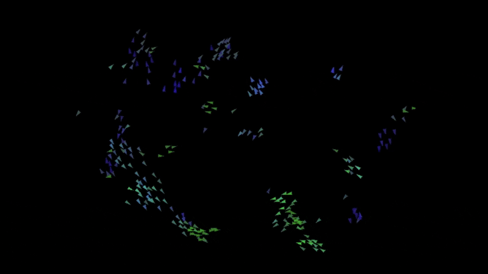

# Boid Simulator

> A simple simulation of flocking behavior using the Boids algorithm. A fun project to practice my python skills! 



## Table of Contents

- [Overview](#overview)
- [Installation](#installation)
- [Usage](#usage)
- [Controls](#controls)
- [Configuration](#configuration)


## Overview

This project simulates the flocking behavior of boids, inspired by Craig Reynolds [Boids algorithm](https://www.red3d.com/cwr/papers/1987/boids.html). The algorithm follow three rules:
- **Separation**: Avoid crowding neighbors
- **Alignment**: Steer toward average heading of neighbors
- **Cohesion**: Steer to move toward average position of neighbors


## Installation

Clone the repository and install any dependencies:

```bash
git clone https://github.com/milesbailey121/boid-simulator.git
cd boid-simulator
pip install -r requirements.txt
```
or
```bash
pip install pygame numpy
```


## Usage

To run the simulation:

```bash
python main.py
```

## Controls


`UP Arrow`

Display or hide visual and proctected ranges


## Configuration

Modify standard simulation parameters in `Constants.py`:

```python
TURNFACTOR  =  0.2
MARGIN  =  100
BOID_NUM  =  250
VISUAL_RANGE  =  40
PROTECTED_RANGE  =  8
MAXSPEED  =  6
MINSPEED  =  3
MAXBIAS  =  0.01
BIAS_INCREMENT  =  0.00004
CENTERING_FACTOR  =  0.005
MATCHING_FACTOR  =  0.05
AVOID_FACTOR  =  0.05
```
----------

> Created by [Miles Bailey](https://github.com/milesbailey121) 

